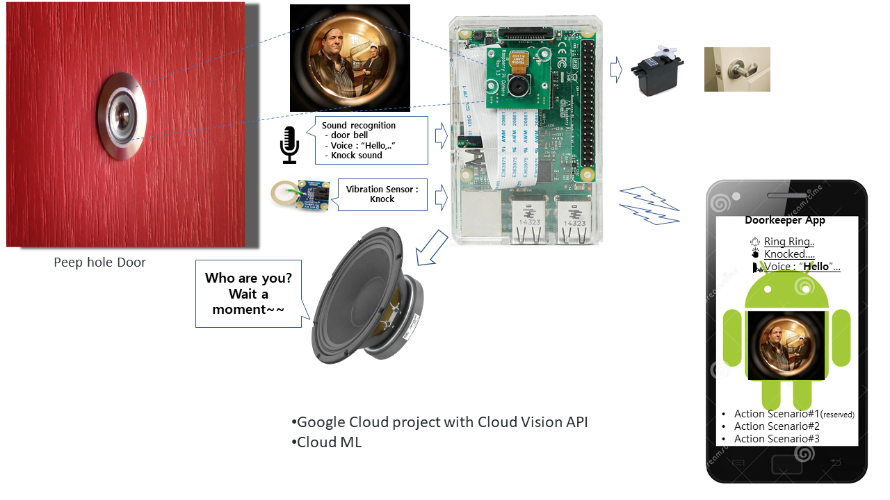

# Androd Things Doorkeeper

The Android Things Doorkeeper
현재 내용 추가하고 다듬는 중.(8.21오전08시. 일단락예정

## Screenshots

## Pre-requisites

- Android Things compatible board : Raspberry pi 3
- The following individual components:
    - 1 push button
    - 1 resistor
    - jumper wires
    - Mic
    - Speaker
- working...

## Running

부재중에 방문객 또는 택배배탈로 도어벨이 울리거나 문을 두드릴 경우,eet 
 1. Mic또는 진동센서로 음성/도어벨/문두드림등을 감지하여, 
 2. "누구세요? 잠시만 기다려주세요, 등의 음성 메시지 출력 , 
 3. 도어에 PeepHole있는 경우 카메라로 영상(인물 성별/나이등) 인식하여 AI 음성 대화 가능. (현관도어폰영상가능).
 4. 안드로이드폰에 상황 전달. 준비된 action을 수행 또는 직접 음성 대화..
 5. 문열림 가능토록 RC서보 조작 기능.
- working...

## Categories

- Android Things

## Solutions

- IoT

## Languages

- Java

## License

- not y...
